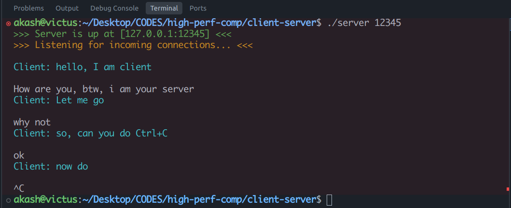
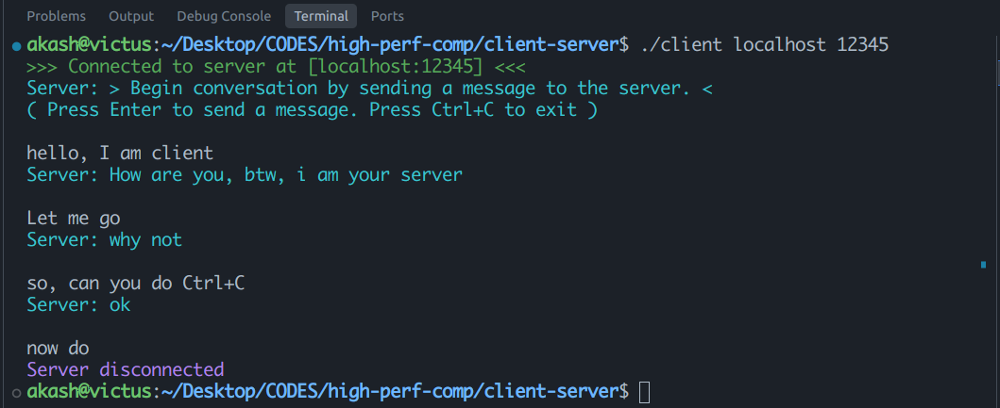

## Client-Server communication
This is a sample program written in C language\
for demonstrating client-server communication\
using TCP socket programming, in C.

### Usage:
Compile and run as:
```bash
# server
gcc server.c -o server
./server <port>

# client
gcc client.c -o client
./client localhost <port>

```
Start by sending the message first from `client`

#### Demo
from_server.png

from_client.png


#### Contact:
@author: Akash
@email: akashmaji@iisc.ac.in

